title=console sous stéroide
date=2018-09-15
type=post
tags=console, outils, cat, ping, man, du, jq, fzf, top, htop, ncdu
status=published
~~~~~~
Ci-dessous un résumé de l'article que vous retrouverez [ici](https://remysharp.com/2018/08/23/cli-improved), qui recense des outils pour booster votre console, ils remplacent avantageusement leurs illustres prédecesseurs. Le tout testé sur OSX.

## bat - (cat)
Pour remplacer ```cat``` bienvenue à ```bat```
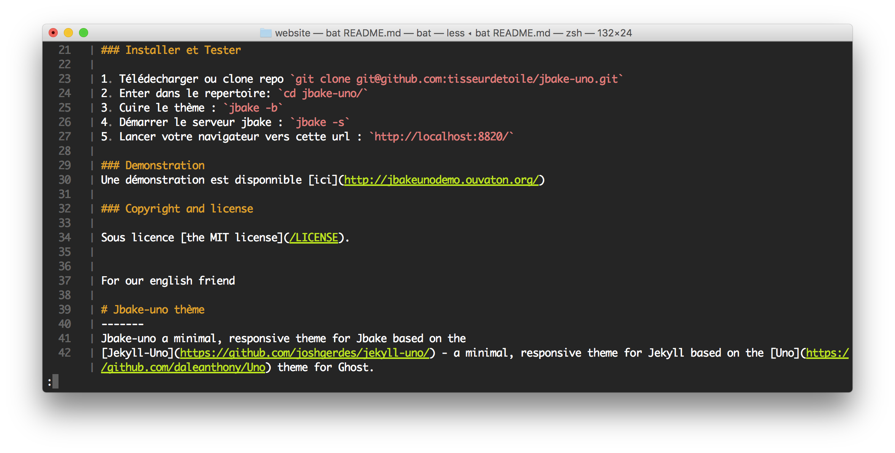
* [site officiel](https://github.com/sharkdp/bat)

### Installation de bat
```# brew install bat```

### Les plus
* coloration syntaxique
* recherche dans le texte
* numérotation des lignes

## prettyping - (ping)
pour remplacer ```ping``` bienvenue à ```prettyping```
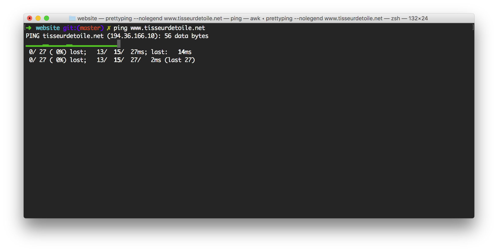
* [site officiel](http://denilson.sa.nom.br/prettyping/)

### Installation
```# brew install prettyping```

### Les plus
* évolution graphique des temps de réponses

## fzf (ctrl-r)
Un couteau suisse de recherche dans les fichiers votre historique ... etc.
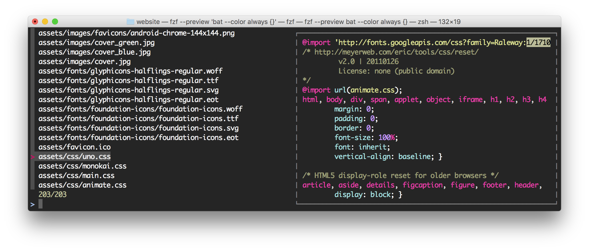
* [site officiel](https://github.com/junegunn/fzf)

### Installation de  fzf
```# brew install fzf```

### Usage
rechercher dans votre historique avec classe (CTRL-R)
rechercher dans vos fichiers avec preview ```fzf --preview 'bat --color always {}'```

### Les plus
* Ah bon on pouvait faire tout cela.

## bashhub (history)
votre historique dans le cloud.
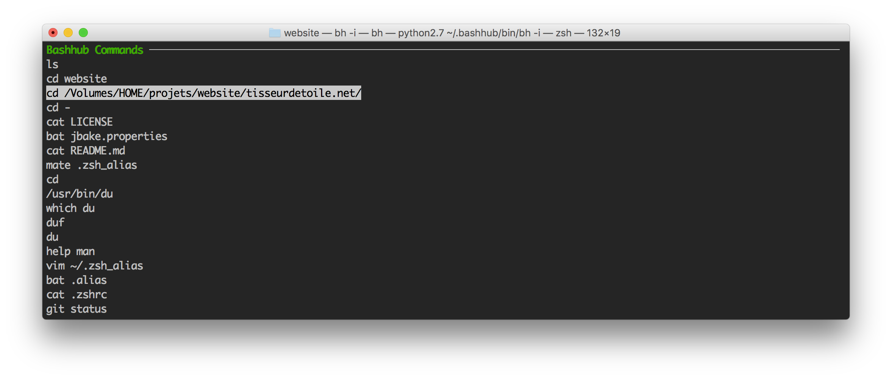
[site officiel](https://bashhub.com/)

### Installation de  bashhub
zsh ```# curl -OL https://bashhub.com/setup && zsh setup ```
bash ```# curl -OL https://bashhub.com/setup && bash setup ```

### Usage
CTRL-b
bh -i

### Les plus
* Ah bon on pouvez faire tout cela..

## htop (top)
Suivre vos performance système.
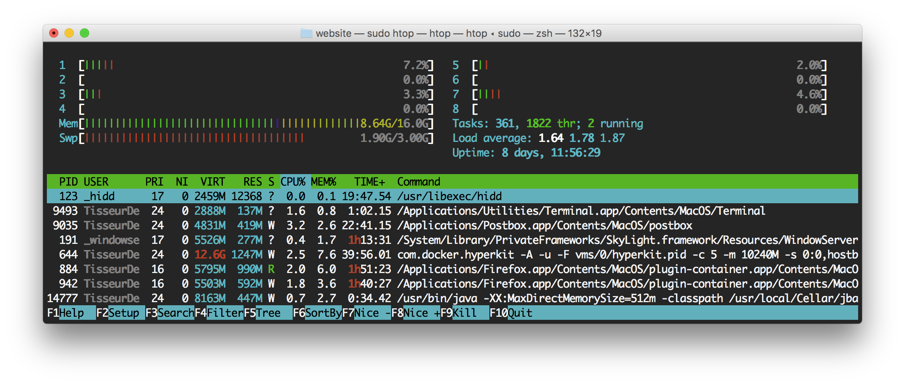
* [site officiel](http://hisham.hm/htop/)

### Installation
```# brew install htop```

## diff-so-fancy (diff)
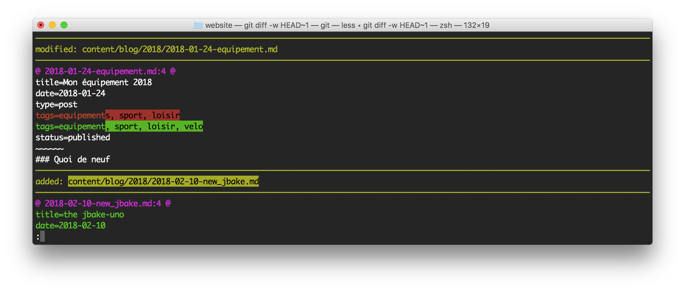
* [site officiel](https://github.com/so-fancy/diff-so-fancy)

### Installation
```# brew install diff-so-fancy```

## fd (find)
rechercher dans vos dossier
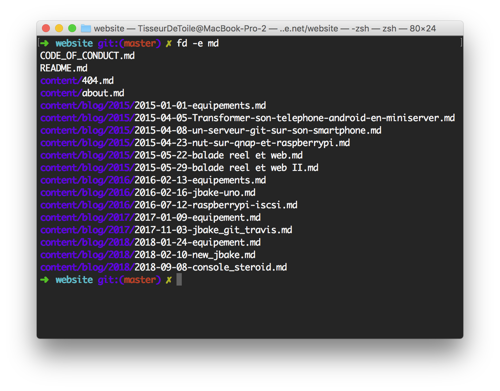
* [site officiel](https://github.com/sharkdp/fd/)

### Installation
```# brew install fd```

## tree (tree)
Affiche une arborecence de repertoire dans le terminal.
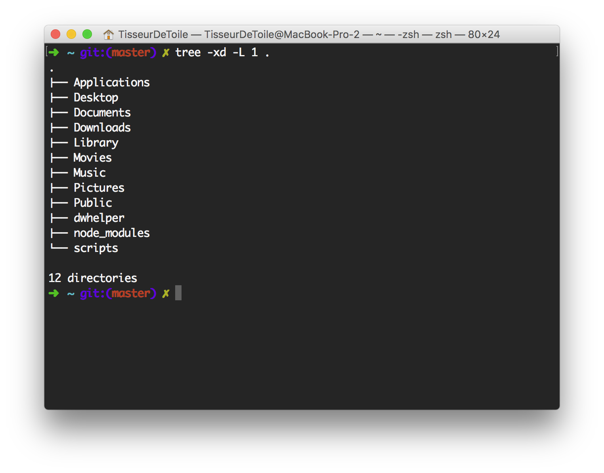
* [site officiel](http://mama.indstate.edu/users/ice/tree/)

### Installation
```# brew install tree```

### Usage
* ```tree -xd -L 1 .```

## ncdu (du)
Interactive disque usage.
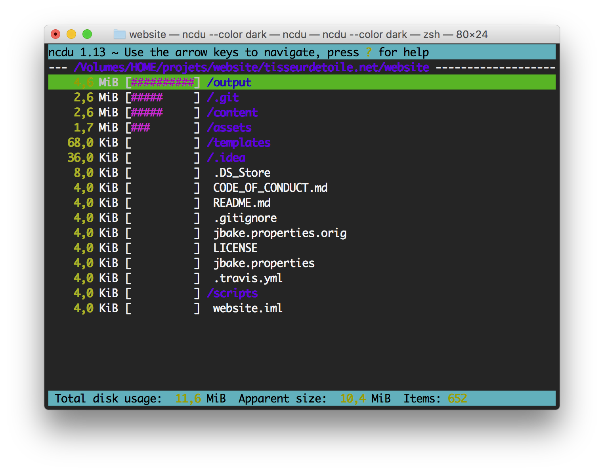
* [site officiel](https://dev.yorhel.nl/ncdu)

### Installation
```# brew install ncdu```

### Usage
* ```ncdu --color dark```

## gotty (gotty)
Exportation de son terminal accessible par une url
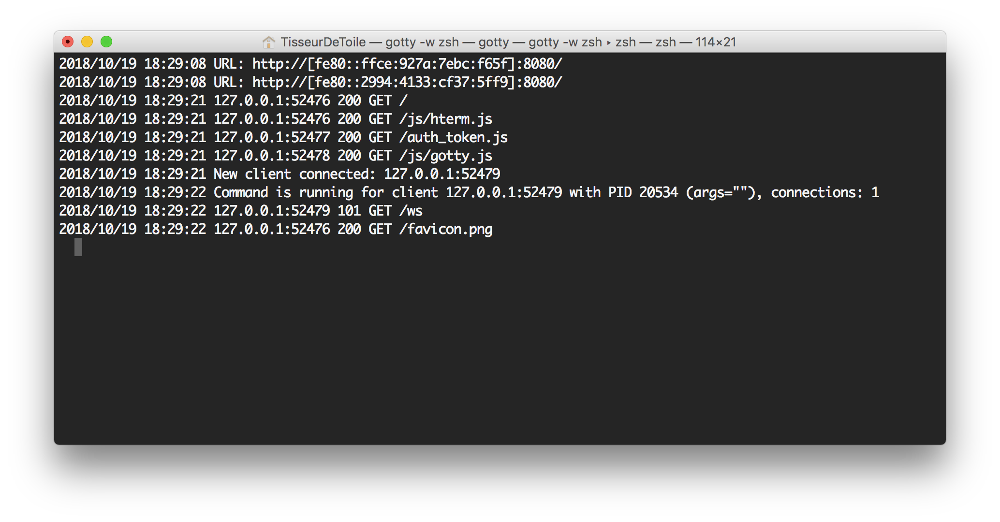
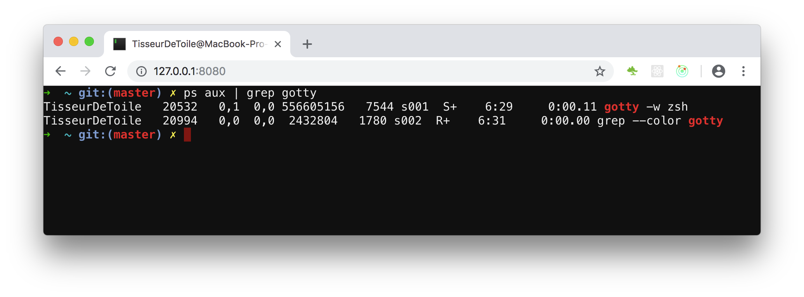

## Installation
```brew install yudai/gotty/gotty ```

### Usage
* ```gotty -w zsh```
Attention dans cette exemple on expote un shell zsh interactif utilisable dans un navigateur.

## jq (interpreter les flux json)
Interpréter les flux json comme un boss
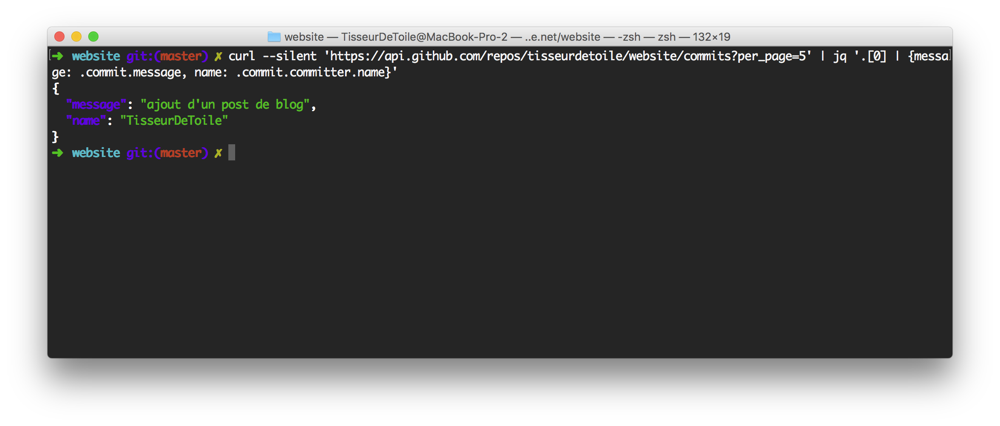
* [site officiel](https://stedolan.github.io/jq/)

### exemple
``` bash
 # curl 'https://api.github.com/repos/tisseurdetoile/website/commits?per_page=5' | jq '.[0] | {message: .commit.message, name: .commit.committer.name}'

 {
   "message": "ajout d'un post de blog",
   "name": "TisseurDeToile"
 }
```
### Installation
```brew install jq```

## changer ses aliases
Selon votre shell modifier le fichiers .zsh_alias ou bash_alias pour qu’il contienne les lignes suivantes.
```
 # cat .zsh_alias
alias cat='bat'
alias ping='prettyping --nolegend'
alias top='sudo htop'
alias du='ncdu --color dark -rr -x --exclude .git --exclude node_modules'
alias help='tldr'
```
`````
``````
