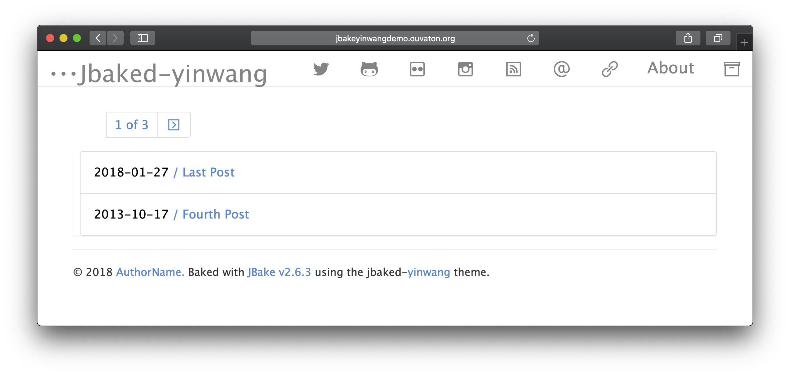

title=Jbake-yinwang mon nouveau thème pour jbake
summary=Jbake-yinwang le nouveau thème simple pour jbake
date=2018-10-30
type=post
tags=blog, jbake, yinwang, theme
status=published
~~~~~~

Voici un nouveau [thème](https://github.com/tisseurdetoile/Jbake-yinwang) pour [jbake](http://www.jbake.org), il est inspiré du thème [ynwang](https://themes.gohugo.io/gohugo-theme-yinwang/) un thème pour [Hugo](https://gohugo.io/)
En résumé il est **simple**, facile a utiliser et **lisible**.

##Les principales fonctionnalités sont :

- Clair
- Coloration syntaxique
- Liens sociaux
- TravisCI integration
- Support de la pagination de jbake (plus de bidouille :P)
- page 404 specifique.

Un petit screenshot ci dessous

En plus de ce site il y a une version de [démo](http://jbakeyinwangdemo.ouvaton.org/) synchronisé avec le repository principal

Vous pouvez trouver un dépot [github](https://github.com/tisseurdetoile/Jbake-yinwang)
avec la derniere version en cours. L'ancien thème [jbake-uno](https://github.com/tisseurdetoile/Jbake-yinwang)
sera archivé et certaine de ses fonctionnalités seront porté sur ce nouveau thèmes.
N'hésitez pas a contribuer.

